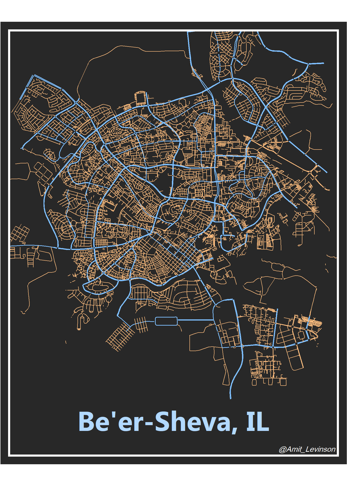
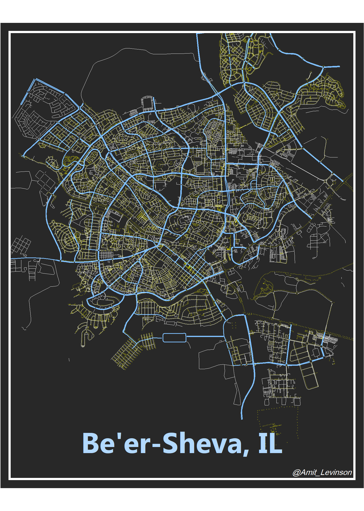
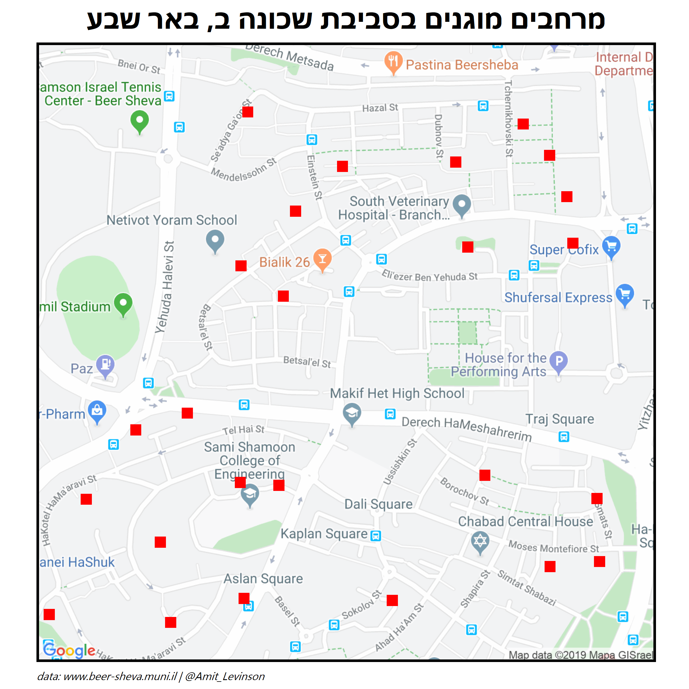
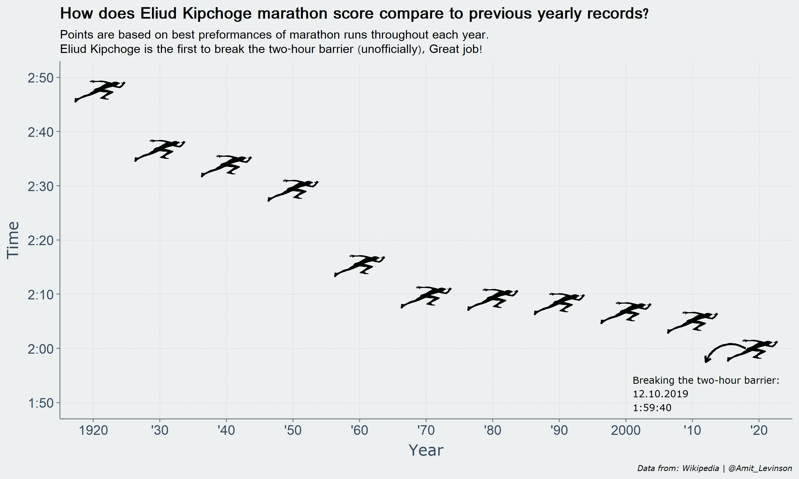

# Single Visualizations

In this folder I display assorted single visualizations I created in different contexts and from datatsets. Some of these have been recreated in a blog post or shared in some format on my website which I invite you to explore:    

#### [amitlevinson.com](https://amitlevinson.com/)  

Anyways, enjoy!  
 

### A revisit to #TidyTuesday
*01.06*  
On behalf of [Almog Simchon](https://almogsi.com/)'s course at Ben-Gurion university of the Negev We were required to explore and visualize findings from a [#TidyTuesday](https://github.com/rfordatascience/tidytuesday) dataset. My partner and I chose a dataset about spotify songs which I explore in a sub-folder of this repository. Below is the final visualization from the exploration:  

[(Link to code and exploration)](https://github.com/AmitLevinson/single_visualizations/blob/master/exploring-tt/README.md) 

### Choosing an appropriate font
*11.05*  
I decided to plot all my available fonts so that I don't have to try a font just to see how it looks. You can always find fonts on [Google fonts](https://fonts.google.com/), download and [install them to windowns](https://www.digitaltrends.com/computing/how-to-install-fonts-in-windows-10/). My personal favorite? ["Roboto Condensed"](https://fonts.google.com/specimen/Roboto+Condensed?preview.text=&preview.text_type=custom&query=roboto+condensed). Plot idea comes from Hadley Wickham's [ggplot 2 book](https://ggplot2-book.org/annotations.html), specifically ch.8.  

[(Link to plot code)](https://github.com/AmitLevinson/single_visualizations/blob/master/plotting-fonts/font-plot.R)  

### **A street map of Be'er-Sheva, IL (left) and the city's light posts (right)**  
*23.11.2019*  
I mapped the streets of Be'er Sheva thanks to [Christian Burkhart](https://ggplot2tutor.com/streetmaps/streetmaps/) blog. Once I mapped the streets (left) I could map the city lights of the city (right) thanks to the municipality's free [open data](https://www.beer-sheva.muni.il/OpenData/Pages/Data.aspx).  

[Link to street map code](https://github.com/AmitLevinson/Projects/blob/master/beer_sheva_municipality/city_streets/street_map_gold.R) | [Link to light posts code](https://github.com/AmitLevinson/Projects/blob/master/beer_sheva_municipality/city_light_posts/city_light_b7_sf.R)  

 

  

### **Mapping bomb shelters in Be'er-Sheva, Israel**  
*12.11.2019*  

In this visualization I mapped the bomb shelters near my neighborhood in Be'er-Sheva. I discovered open data sets from our municipality's website and took the next day's opportunity (missiles fired towards Israel) to plot bomb shelters. I've since created a blog post on my website explaining how I made this map along with an interactive leaflet package; you can find it [here](https://amitlevinson.com/post/bomb-shelters/).    

[Link to code](https://github.com/AmitLevinson/Projects/blob/master/beer_sheva_municipality/mapping_bomb_shelters/shelters_b.R)

  

### **Eliud Kipchoge unformal marathon record**  
*12.10.2019*  

In this visualization I took Eliud Kipchoge's marathon score of under 2 hours (1:59:40) and situated it in comparison to previous yearly records. I've since created a blog post where I scrape the data from Wikipedia and explain how I create this plot; you can find it [here](https://amitlevinson.com/post/eliud-kichoge/)    

[Link to code](https://github.com/AmitLevinson/Random_Visualizations/blob/master/Marathon_Records/marathon_runs.R)
 

