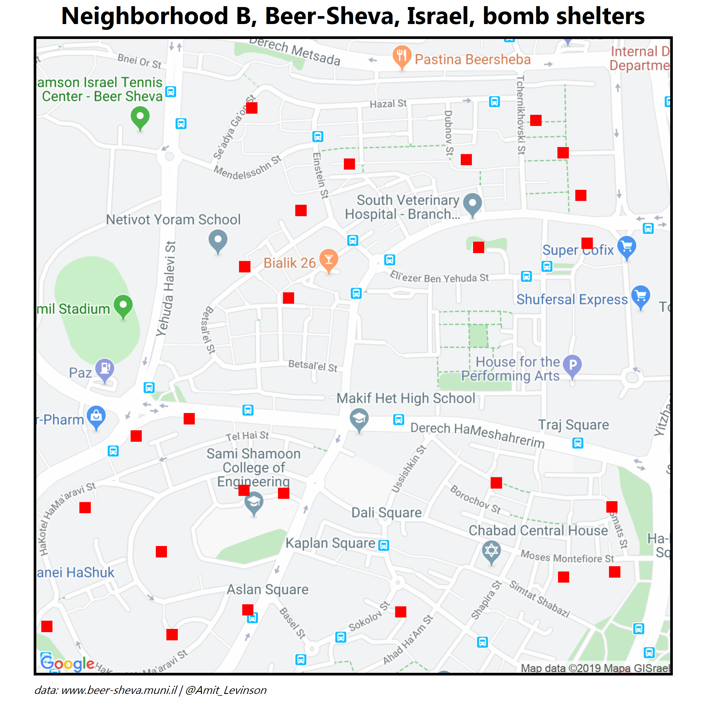

## Random Visualizations:

In this folder I display assorted visualizations I created, Enjoy!  
 

### **Mapping bomb shelters in Be'er-Sheva, Israel**  
*12.11.2019*  
 
In this visualization I mapped the bomb shelters near my neighborhood in Be'er-Sheva.  
[Link to code](https://github.com/AmitLevinson/Projects/blob/master/beer_sheva_municipality/mapping_bomb_shelters/shelters_b.R)

  

### **Eliud Kipchoge unformal marathon record**
*12.10.2019*
 
In this visulizaiton I took Eliud Kipchoge's marathon score of under 2 hours (1:59:40) and situated it in comparison to previous yearly records.  
[Link to code](https://github.com/AmitLevinson/Random_Visualizations/blob/master/Marathon_Records/marathon_runs.R)
 

