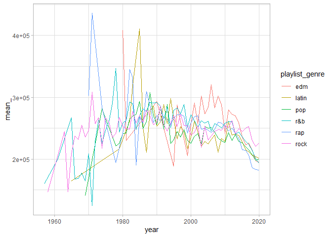
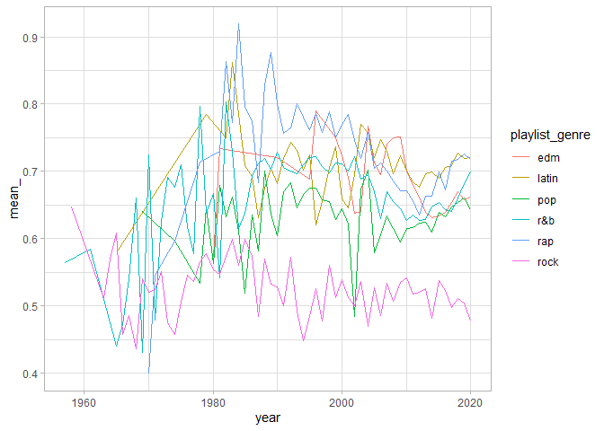
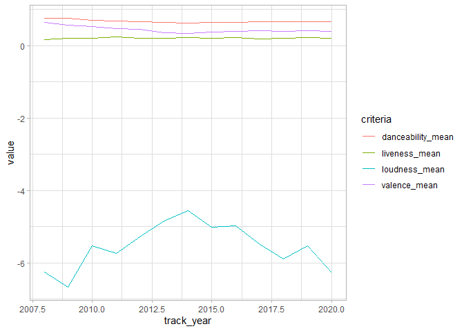

Exploring spotify songs
================
Amit Levinson
6/1/2020

## What is this?

This is an assignment on behalf of [Almog
Simchon](https://almogsi.com/)’s course at Ben-Gurion university of
the Negev. We were required to explore and visualize findings from a
[\#TidyTuesday](https://github.com/rfordatascience/tidytuesday) dataset.
My partner and I chose data about spotify songs which I explore below.
Skip to the end if you’re interested in the final visualization.

### Libraries

``` r
library(tidyverse)
library(lubridate)
library(ggpomological)
library(extrafont)

spotify_songs <- readr::read_csv('https://raw.githubusercontent.com/rfordatascience/tidytuesday/master/data/2020/2020-01-21/spotify_songs.csv')
```

### Exploration

Explore playlist genre by mean duration:

``` r
by_duration <- spotify_songs %>%
    mutate(year = year(as.Date(track_album_release_date, "%Y-%m-%d"))) %>% 
    group_by(playlist_genre,year) %>% 
    summarise_at(vars(duration_ms),list(mean_ = mean, sd_ = sd)) %>% 
    ungroup()

ggplot(by_duration, aes(x = year, y= mean_, fill = playlist_genre, color = playlist_genre, group = playlist_genre))+
    geom_line()+
    theme_light()
```



That’s not too helpul, let’s try by exploring by mean danceability:

``` r
spotify_songs %>%
  mutate(year = year(as.Date(track_album_release_date, "%Y-%m-%d"))) %>% 
  group_by(playlist_genre,year) %>% 
  summarise_at(vars(danceability),list(mean_ = mean, sd_ = sd)) %>% 
  ungroup() %>% 
  ggplot(aes(x = year, y= mean_, fill = playlist_genre, color = playlist_genre, group = playlist_genre))+
  geom_line()+
  theme_light()
```



Again, doesn’t seem helpful. How about by popularity?

``` r
spotify_songs_y <- spotify_songs %>%
  mutate(track_year = year(as.Date(track_album_release_date, "%Y-%m-%d"))) 

spotify_pop <- spotify_songs_y %>% 
  group_by(playlist_genre, track_year) %>% 
  summarise(mean_pop = mean(track_popularity),
            count_n = n()) %>%
  filter(track_year >= 2000) %>% 
  ungroup()

ggplot(spotify_pop,aes(x = track_year, y = mean_pop, color = playlist_genre))+
  geom_line()
```


Hmm, What’s happenning in edm throughout 2000-2010?

``` r
spotify_pop %>% 
  filter(playlist_genre == "edm") %>% 
  arrange(track_year) %>% 
  knitr::kable()
```

| playlist\_genre | track\_year | mean\_pop | count\_n |
| :-------------- | ----------: | --------: | -------: |
| edm             |        2000 |  56.25000 |        4 |
| edm             |        2001 |  45.00000 |        3 |
| edm             |        2002 |  65.50000 |        2 |
| edm             |        2003 |  40.33333 |        3 |
| edm             |        2004 |  47.00000 |        3 |
| edm             |        2005 |  41.00000 |        4 |
| edm             |        2006 |  19.78571 |       14 |
| edm             |        2007 |  15.71429 |       21 |
| edm             |        2008 |  15.41463 |       41 |
| edm             |        2009 |  16.70455 |       44 |
| edm             |        2010 |  35.20000 |       35 |
| edm             |        2011 |  34.06061 |       66 |
| edm             |        2012 |  35.26752 |      157 |
| edm             |        2013 |  19.49836 |      305 |
| edm             |        2014 |  20.92143 |      560 |
| edm             |        2015 |  26.34565 |      460 |
| edm             |        2016 |  30.51411 |      496 |
| edm             |        2017 |  33.43918 |      485 |
| edm             |        2018 |  36.33377 |      755 |
| edm             |        2019 |  43.26023 |     2321 |
| edm             |        2020 |  40.31522 |      184 |

Did something happen in playlist\_genre of edm from 2009-2010 jumping 19
points?

``` r
spotify_songs_y %>%
  filter(playlist_genre == "edm", between(track_year, 2009,2010)) %>% 
  arrange(-track_popularity) %>% 
  select(track_year,everything()) %>% 
  head(10)
```

    ## # A tibble: 10 x 24
    ##    track_year track_id track_name track_artist track_popularity track_album_id
    ##         <dbl> <chr>    <chr>      <chr>                   <dbl> <chr>         
    ##  1       2010 15JINEq~ Love The ~ Eminem                     82 47BiFcV59TQi2~
    ##  2       2009 0SiywuO~ Bad Roman~ Lady Gaga                  78 6rePArBMb5nLW~
    ##  3       2010 2CEgGE6~ Dynamite   Taio Cruz                  77 0eGvq1J5Ke7Vl~
    ##  4       2010 1gv4xPa~ Raise You~ P!nk                       76 3uQMzfrf4kUNG~
    ##  5       2010 4lLtanY~ Grenade    Bruno Mars                 75 6J84szYCnMfzE~
    ##  6       2010 7GAaTpS~ Need You ~ Lady Antebe~               73 5RypFF6rN9MUx~
    ##  7       2010 0C4ejWm~ S&M        Rihanna                    72 7vN82vd1Vq44f~
    ##  8       2010 1bM50IN~ OMG (feat~ Usher                      72 6A1F3Fkq5dYeY~
    ##  9       2010 7ElF5zx~ Break You~ Taio Cruz                  71 0eGvq1J5Ke7Vl~
    ## 10       2010 1QnvpPF~ Airplanes~ B.o.B                      68 6f06neONZ0xqq~
    ## # ... with 18 more variables: track_album_name <chr>,
    ## #   track_album_release_date <chr>, playlist_name <chr>, playlist_id <chr>,
    ## #   playlist_genre <chr>, playlist_subgenre <chr>, danceability <dbl>,
    ## #   energy <dbl>, key <dbl>, loudness <dbl>, mode <dbl>, speechiness <dbl>,
    ## #   acousticness <dbl>, instrumentalness <dbl>, liveness <dbl>, valence <dbl>,
    ## #   tempo <dbl>, duration_ms <dbl>

9/10 songs dominant the top 10 songs, did something change?

``` r
spotify_songs_y %>% 
  filter(playlist_genre == "edm", track_year >= 2008) %>%
  select(danceability, valence, liveness, loudness, track_year) %>% 
  group_by(track_year) %>%
  summarise_at(vars(danceability, valence, liveness, loudness),list(mean = mean, sd = sd)) %>%
  right_join(spotify_pop, by = c("track_year" = "track_year")) %>% 
  drop_na() %>% 
  pivot_longer(cols = ends_with("mean"), names_to = "criteria", names_prefix = "_mean") %>% 
  pivot_longer(cols = ends_with("sd"), names_to = "criteria_sd", names_prefix = "_mean", values_to = "sd") %>% 
  ggplot(aes(x = track_year, y = value, color = criteria))+
  geom_line()
```



Not sure, doesn’t seem like a pattern.

## By Band

It’s time to move onto something else. Let’s look at the top bands. Top
= with the most count of records.

``` r
by_artist <- spotify_songs_y %>%
  group_by(track_artist) %>%
  filter(n() >= 80) %>% 
  select(track_artist, track_name, track_popularity) %>% 
  distinct(track_artist, track_name, .keep_all = TRUE)

by_artist_mean <- by_artist %>% 
  group_by(track_artist) %>% 
  summarise(popularity = mean(track_popularity)) %>% 
  mutate(track_name = "mean", .before = popularity,
        track_artist = fct_reorder(track_artist, popularity))

ggplot(by_artist, aes(y = track_artist, x = track_popularity))+
  geom_point()+
  geom_point(data = by_artist_mean, aes(y = track_artist, x = popularity), color = "red")+
    theme(
      panel.background = element_blank())
```


Hmm, again, we see some variance in between bands and artist, for
example Drake doesn’t have a song too close to the mean (the red dot).
Queen all in all have an OK average compared to the rest but with a
distribution somewhat across it with classics ranked high.

Let’s turn to look at difference from mean and see if there’s a pattern
according to when the song was released.

``` r
by_artist_mean <- by_artist %>% 
  group_by(track_artist) %>% 
  summarise(popularity = mean(track_popularity)) %>% 
  top_n(7) %>% 
  pull(track_artist)

artist_songs <- spotify_songs %>% 
  filter(track_artist %in% by_artist_mean) %>% 
  mutate(track_date = as.Date(track_album_release_date, "%Y-%m-%d")) %>%
  distinct(track_id, .keep_all = TRUE) %>%
  arrange(track_date) %>%
  select(track_artist, track_name, track_popularity, track_date) %>% 
  add_count(track_artist) %>% 
  group_by(track_artist) %>% 
  mutate(song_seq = seq(1,length(track_name), 1),.before = track_popularity,
         mean_pop = mean(track_popularity),
         mean_diff = mean_pop - track_popularity,
         val = ifelse(mean_diff >0, "pos", "neg")) %>% 
  ungroup() %>% 
  mutate(track_artist = fct_reorder(track_artist, n))


ggplot(artist_songs, aes(x = song_seq, y = mean_diff, fill = val))+
  geom_col(show.legend = FALSE)+
  facet_wrap(~ track_artist, scales = "free", ncol = 1)+
  theme_minimal()+
  scale_fill_manual(values = c(pos = "#919c4c", neg = "#c03728"))+
  labs(title = "Band Song Popularity", subtitle = "Songs' difference from mean from the first to the last song released. Left side of X axis is the first\nsong released moving right in a chronological order, where the right side is the last song released.\nThe bands (according to avergae) out of those with 80 records were chosen\n",
    x = "Chronological order of songs", y = NULL)+
  theme(
    text = element_text(family = "Roboto Condensed", hjust = 0.5),
    plot.title = element_text(size = 20, hjust = 0.5, face = "bold"),
    plot.subtitle = element_text(size = 13, color = "grey50", hjust = 0.5),
    strip.text = element_text(size = 14, color = "grey25"),
    plot.background = element_rect(fill = "#F5F5F5"),
    axis.text = element_blank(),
    axis.title.x = element_text(size = 12, color = "grey50"),
    panel.grid = element_blank(),
    panel.border = element_blank(),
    panel.background = element_blank())

ggsave("plot.png", height = 16, width = 12)
```


Not too bad with some things we saw previously such as Drake’s high
variance and Martin Garrix with also a large difference between his
first to last songs.
