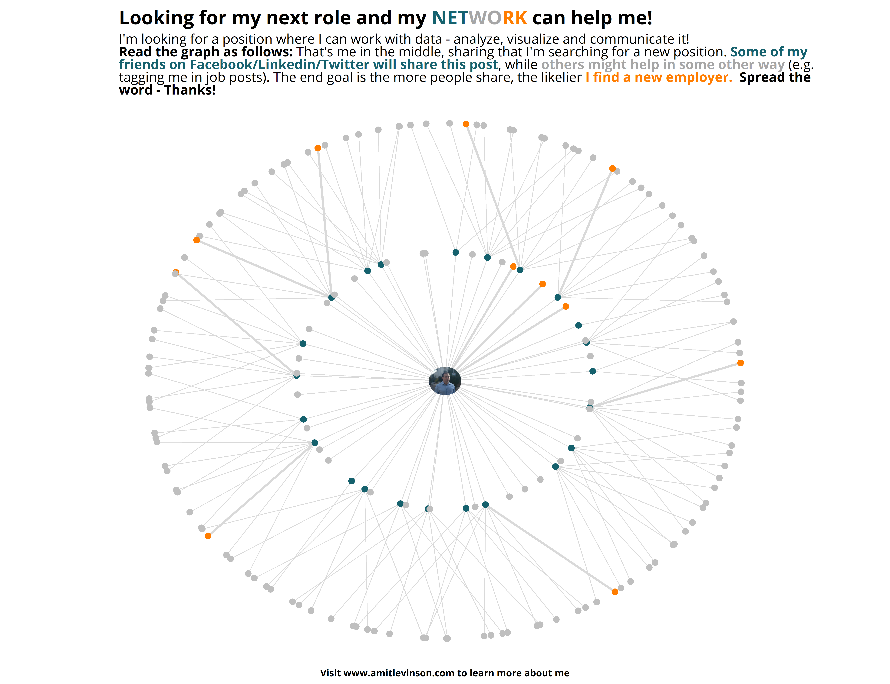

## I'm looking for my next role!

I wanted to post on Social Networks Sites (SNS) that I am looking for my next position. I also knew that it would be a great opportunity to showcase some of my skills, so I decided to accompany it with a graph. After some thought I decided to create a network graph emphasizing the importance of my connections spreading the word.

The code is publicly available below.

<details>
  <summary>**Code for the plot**</summary>
```{r}
library(dplyr)
library(ggplot2)
library(ggtext)
library(extrafont)
library(purrr)
library(ggraph)
library(igraph)
library(tidygraph)
library(glue)
library(ggimage)

me <- 1

# The second circle vector
close_circle_vec <- 2:52

# Create a distribution of various types of individuals in the network
type <- sample(c("Sharer", "Non-sharing", "employer"), size = length(close_circle_vec), replace = TRUE, prob = c(0.55,0.40,0.05))

# Now create the close circle network
close_circle <- tibble(name = 1,
                       to = close_circle_vec, 
                       type = type)

# Get the IDs of sharers to make the second outer circle
outer_circle_vec <- close_circle %>% 
  filter(type == "Sharer") %>% 
  pull(to)

# A function to create a set of unique nodes connected to one sharer for the outer circle
get_friends <- function(x) {
  # Multiply by 100 to get unique ids
  x_unique <- x * 100
  lb <- x_unique-5
  up <- x_unique+5
  # When sharing a random number of people sees it
  n_to_sample <- sample(1:8, size = 1)
  # Return table with the original sharer and new viewers
  df_level2 <- tibble(name = x,
                      to = sample(lb:up,size = n_to_sample, replace = FALSE))
  return(df_level2)
}

# Iterate to get the 2nd (outer) circle connected to sharers
outer_circle <- map_dfr(outer_circle_vec , get_friends)

# Again, each node receives a 'type' to show how they behave in the network
out_circle_info <- data.frame(to = unique(outer_circle$to),
                              type = sample(c("Non-sharing", "employer") , size = length(unique(outer_circle$to)),
                                            replace = TRUE, prob = c(0.9,0.1)))

# Join it back in
outer_circle <- outer_circle %>% 
  left_join(out_circle_info)

# Bind inner and outer circle to one data frame
both_info <- rbind(close_circle, outer_circle) %>% 
  # Just so we can emphsize edges to employers
  mutate(is_employer = ifelse(type == "employer", "yes", "no"))

# convert to tbl_graph
all_network <- both_info %>% 
  as_tbl_graph()

# Create info for the nodes (wasn't evident in the first tbl_graph)
node_info <- both_info %>%
  select(-name) %>%
  distinct()

# Now add info to the nodes (who does what - share, not-share & employer)
edited_graph <- all_network %>% 
  activate(nodes) %>% 
  mutate(name = as.integer(name)) %>% 
  left_join(node_info, by = c("name" = "to"))

# Get circular image (if doesn't exists create it with the black mask)
if (file.exists("job-search/circle-me.png")){
  circle_me <- "job-search/circle-me.png"
}else{
  
  library(magick)
  mask <- "job-search/mask.png" %>% 
    image_read() %>% 
    image_scale("425")
  
  circle_image <- image_read("job-search/img.jpg") %>% 
    image_scale("475") %>% 
    image_composite(mask, ., "plus") %>% 
    image_trim() %>% 
    image_transparent("white")
  
  image_write(circle_image, "job-search/circle-me.png")
  
  circle_me <- "job-search/circle-me.png"
}

# String for the colored network word in the title
network_text <- "<span style='color:#15616D'>NET</span><span style='color:gray65'>WO</span><span style='color:#FF7D00'>RK</span>"


ggraph(edited_graph, layout = "focus", focus = 1)+
  geom_edge_link(aes(edge_width = factor(is_employer)), color = "gray85", show.legend = FALSE)+
  geom_node_point(aes(filter = (name !=1), color = type), shape = 19, size = 3.5, show.legend = FALSE)+
  # image in the middle
  geom_image(aes(x = 0, y = 0, image = circle_me), size = 0.05)+
  # Add node color
  scale_color_manual(name = NULL, values = c("employer" = "#FF7D00", "Sharer" = "#15616D", "Non-sharing" = "gray75"))+
  # Add egdge width for employers
  scale_edge_width_manual(values = c("yes" = 1.1, "no" = 0.35))+
  # Play with the network height/width ratio
  coord_fixed(ratio = 1/1.15)+
  labs(title = glue("<b>Looking for my next role and my {network_text} can help me!<b>"),
       subtitle = "I'm looking for a position where I can work with data - analyze, visualize and communicate it!<br><b>Read the graph as follows:</b> That's me in the middle, sharing that I'm searching for a new position. <b><span style='color:#15616D'>Some of my<br>friends on Facebook/Linkedin/Twitter will share this post</span></b>, while <b><span style='color:gray65'>others might help in some other way</span></b> (e.g.<br>tagging me in job posts). The end goal is the more people share, the likelier <b><span style='color:#FF7D00'>I find a new employer.</span></b> <b>Spread the<br>word - Thanks!</b>",
       caption = "**Visit www\\.amitlevinson.com to learn more about me**")+
  theme_void()+
  theme(
    text = element_text(family = "Open Sans"),
    legend.position = 'top',
    plot.title = element_markdown(size = 20),
    plot.subtitle = element_markdown(size = 14),
    plot.caption = element_markdown(size = 10, hjust = 0.5),
    legend.key.size = unit(0.1, "mm"),
    plot.margin = margin(2,2,2,2, "mm")
  )

  
# Save
ggsave("job-search/network.png", width = 13, height = 10, dpi = 500)
  
```
</details>

<br>

